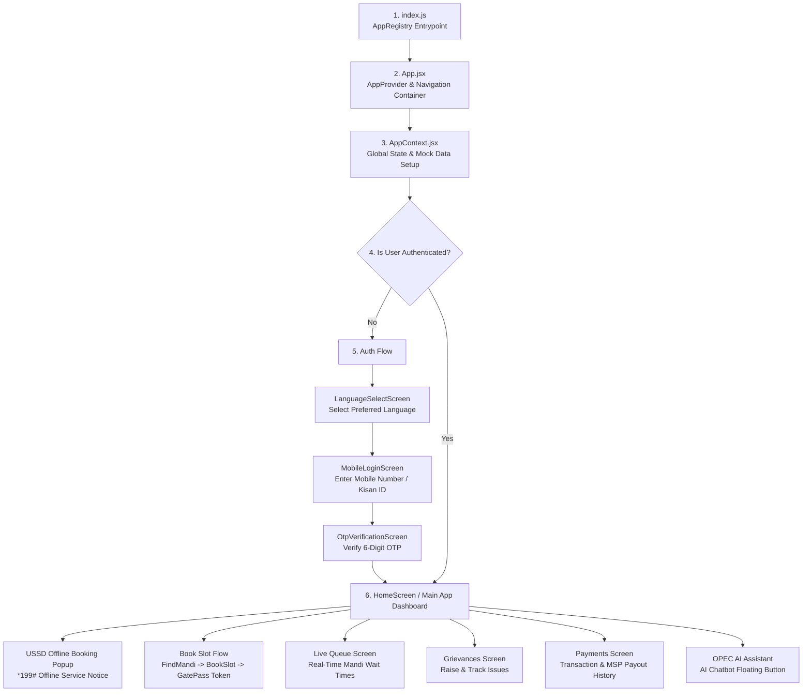
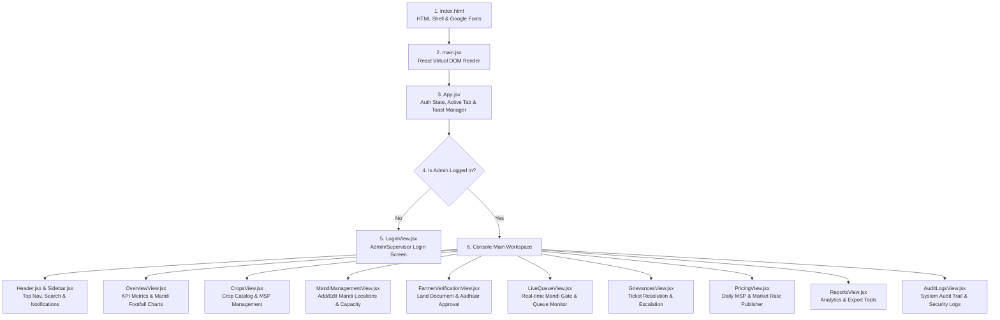

# 🗺️ OPEC Application Architecture & Execution Flow Map

This document outlines the **execution order**, **component hierarchy**, and **short functional description** for both the **OPEC Mobile App** and the **OPEC Admin Web Portal**.

---

## 📱 1. OPEC Mobile App (`SmartMandi`) — Execution Order & Flow

### 📋 Code Breakdown & Functional Roles (Mobile App)

| Order | File / Part | Description & What It Does |
| :--- | :--- | :--- |
| **1** | [`index.js`](file:///e:/SIH/Project/SmartMandi/index.js) | **Native Entrypoint**: Registers the root React Native component with `AppRegistry`. |
| **2** | [`App.jsx`](file:///e:/SIH/Project/SmartMandi/App.jsx) | **Root Wrapper & Router**: Wraps the app in `AppProvider` and manages screen stack navigation (`currentScreen`). |
| **3** | [`AppContext.jsx`](file:///e:/SIH/Project/SmartMandi/src/context/AppContext.jsx) | **Global State Hub**: Holds user profile, selected crop, active booking token, mandis list, grievances, and language settings. |
| **4** | [`LanguageSelectScreen.jsx`](file:///e:/SIH/Project/SmartMandi/src/screens/auth/LanguageSelectScreen.jsx) | **Auth Step 1**: First screen presented to new users to select their preferred language (Hindi, English, Punjabi, etc.). |
| **5** | [`MobileLoginScreen.jsx`](file:///e:/SIH/Project/SmartMandi/src/screens/auth/MobileLoginScreen.jsx) | **Auth Step 2**: Captures the farmer's 10-digit mobile number or Kisan ID. |
| **6** | [`OtpVerificationScreen.jsx`](file:///e:/SIH/Project/SmartMandi/src/screens/auth/OtpVerificationScreen.jsx) | **Auth Step 3**: Verifies the 6-digit OTP code and logs the farmer into the app. |
| **7** | [`HomeScreen.jsx`](file:///e:/SIH/Project/SmartMandi/src/screens/home/HomeScreen.jsx) | **Main Dashboard**: Displays active booking tokens, crop filters, recommended mandis, offline USSD notice (*199#), and quick actions. |
| **8** | [`FindMandiScreen.jsx`](file:///e:/SIH/Project/SmartMandi/src/screens/booking/FindMandiScreen.jsx) | **Mandi Finder**: Lets farmers search nearby mandis by crop type, distance, and live capacity levels. |
| **9** | [`BookSlotScreen.jsx`](file:///e:/SIH/Project/SmartMandi/src/screens/booking/BookSlotScreen.jsx) | **Slot Booking**: Selects arrival date, time slot, crop weight (quintals), and vehicle details. |
| **10**| [`GatePassScreen.jsx`](file:///e:/SIH/Project/SmartMandi/src/screens/booking/GatePassScreen.jsx) | **Digital Pass**: Generates official Token Number & QR Code Gate Pass for Mandi entry. |
| **11**| [`LiveQueueScreen.jsx`](file:///e:/SIH/Project/SmartMandi/src/screens/mandi/LiveQueueScreen.jsx) | **Queue Tracker**: Shows real-time vehicle queue progress, estimated wait times, and gate gate status. |
| **12**| [`GrievanceScreen.jsx`](file:///e:/SIH/Project/SmartMandi/src/screens/grievance/GrievanceScreen.jsx) | **Issue Redressal**: Allows farmers to report pricing discrepancies, delay complaints, or payment issues. |
| **13**| [`PaymentsScreen.jsx`](file:///e:/SIH/Project/SmartMandi/src/screens/payments/PaymentsScreen.jsx) | **Financial Records**: Tracks direct bank transfers (DBT), MSP payouts, and transaction history. |
| **14**| [`AIChatbotModal.jsx`](file:///e:/SIH/Project/SmartMandi/src/components/chat/AIChatbotModal.jsx) | **Kisan AI Assistant**: Multilingual AI chatbot providing instant answers on MSP rates, weather, and queue status. |

---

## 💻 2. OPEC Admin Web Portal (`SmartMandi_Admin_web`) — Execution Order & Flow

### 📋 Code Breakdown & Functional Roles (Admin Web Portal)

| Order | File / Part | Description & What It Does |
| :--- | :--- | :--- |
| **1** | [`index.html`](file:///e:/SIH/Project/SmartMandi_Admin_web/index.html) | **HTML Entry Shell**: Loads base web document, favicons, and Google Fonts (`Plus Jakarta Sans`). |
| **2** | [`main.jsx`](file:///e:/SIH/Project/SmartMandi_Admin_web/src/main.jsx) | **React Mounting**: Mounts the main React application root to the `#root` DOM element. |
| **3** | [`App.jsx`](file:///e:/SIH/Project/SmartMandi_Admin_web/src/App.jsx) | **Root Admin Controller**: Manages current user session, active tab state (`activeTab`), layout mode (Sidebar vs TopNav), and toast notifications. |
| **4** | [`LoginView.jsx`](file:///e:/SIH/Project/SmartMandi_Admin_web/src/components/LoginView.jsx) | **Admin Authentication**: Multi-role login screen (System Admin, Mandi Supervisor, Verification Officer) with phone OTP or email login. |
| **5** | [`Header.jsx`](file:///e:/SIH/Project/SmartMandi_Admin_web/src/components/Header.jsx) | **Top Bar Navigation**: Contains OPEC branding logo, search bar, notifications bell, layout switcher, and user profile popup. |
| **6** | [`Sidebar.jsx`](file:///e:/SIH/Project/SmartMandi_Admin_web/src/components/Sidebar.jsx) | **Navigation Menu**: Collapsible left sidebar for switching between admin management modules. |
| **7** | [`OverviewView.jsx`](file:///e:/SIH/Project/SmartMandi_Admin_web/src/components/OverviewView.jsx) | **Admin Dashboard**: Displays high-level KPI cards (Total Farmers, Active Mandis, Today's Volume, Open Grievances) and footfall trends graph. |
| **8** | [`CropsView.jsx`](file:///e:/SIH/Project/SmartMandi_Admin_web/src/components/CropsView.jsx) | **Crops Management**: Hub for managing crop categories, MSP pricing baselines, and seasonal crop yields. |
| **9** | [`MandiManagementView.jsx`](file:///e:/SIH/Project/SmartMandi_Admin_web/src/components/MandiManagementView.jsx) | **Mandi Directory**: Manages mandi locations, operational hours, total capacity limits, and supervisor assignments. |
| **10**| [`FarmerVerificationView.jsx`](file:///e:/SIH/Project/SmartMandi_Admin_web/src/components/FarmerVerificationView.jsx) | **KYC & Document Review**: Allows officers to inspect land records, Aadhaar details, and approve/reject farmer verification applications. |
| **11**| [`LiveQueueView.jsx`](file:///e:/SIH/Project/SmartMandi_Admin_web/src/components/LiveQueueView.jsx) | **Live Operations Monitor**: Real-time overview of vehicle queues, gate entries, and estimated wait times across all mandis. |
| **12**| [`GrievancesView.jsx`](file:///e:/SIH/Project/SmartMandi_Admin_web/src/components/GrievancesView.jsx) | **Helpdesk & Tickets**: Central ticket resolution desk to review, respond to, and resolve farmer complaints. |
| **13**| [`PricingView.jsx`](file:///e:/SIH/Project/SmartMandi_Admin_web/src/components/PricingView.jsx) | **MSP & Market Pricing**: Interface for publishing daily market rates and government Minimum Support Prices (MSP). |
| **14**| [`ReportsView.jsx`](file:///e:/SIH/Project/SmartMandi_Admin_web/src/components/ReportsView.jsx) | **Analytics & Exports**: Generates downloadable PDF/Excel reports on mandi volume, trade revenue, and farmer footfall. |
| **15**| [`AuditLogsView.jsx`](file:///e:/SIH/Project/SmartMandi_Admin_web/src/components/AuditLogsView.jsx) | **Security Audit**: Immutable logs tracking all administrative actions, data edits, and verification decisions. |

---

## ⚙️ 3. Native Android Build Pipeline (`SmartMandi/android`)

1. **[`settings.gradle`](file:///e:/SIH/Project/SmartMandi/android/settings.gradle)**: Autolinks React Native native modules (`autolinkLibrariesFromCommand()`) and defines project modules.
2. **[`build.gradle`](file:///e:/SIH/Project/SmartMandi/android/build.gradle)** (Root): Configures global Gradle dependencies, Android SDK versions (`minSdkVersion = 24`, `compileSdkVersion = 37`), and Kotlin version (`2.2.0`).
3. **[`app/build.gradle`](file:///e:/SIH/Project/SmartMandi/android/app/build.gradle)**: Configures APK splits by architecture (`arm64-v8a`, `armeabi-v7a`, `x86_64`), Hermes engine, and automated `llvm-strip` task for compact APK sizes (**~26MB - 30MB**).
4. **[`strings.xml`](file:///e:/SIH/Project/SmartMandi/android/app/src/main/res/values/strings.xml)** & **[`Info.plist`](file:///e:/SIH/Project/SmartMandi/ios/SmartMandi/Info.plist)**: Defines the installed app label **`OPEC`** on mobile home screens.
